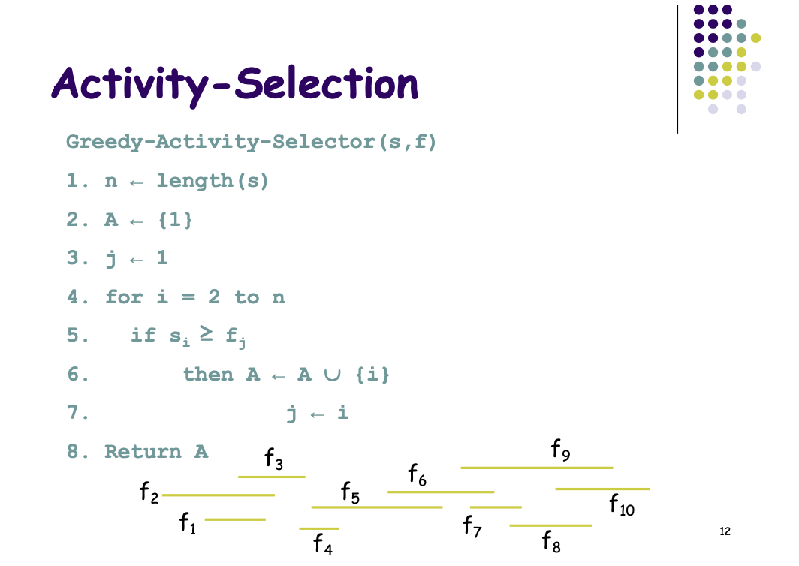

# Elevator routing system
*OOP 2021 course assignment

the goal of this assiment is to crate an offline Algorithm in-order dispatch elevatores to answer the calls ,so the wait time is minimal.

by using Activity-Selection Algorithem we war able to complite the assignment.

## Activity-Algorithm 

## Offline Discription Of the Algorithm 

1. When there are calls from several floors, all elevators will be evenly divided by the number of calls.

2. If there is an elevator in a rest position on the floor from which a call was made, that elevator will be embedded and start moving to Passed the destination. 
(If there are intermediate floors from which calls were also made to the destination in the direction of the original destination of the elevator, the elevator will stop there as well.)

3. If there are calls from several floors and there is no elevator on those floors, and these floors are not mezzanines: an elevator will reach the floor from which the call was made and on the way to its destination floor it will stop at mezzanines from which calls were made.

4. (If there is an elevator 1, the elevator first goes up to the top floor and picks up people who go up, and then you start going down to the entrance floor and pick up people on their way to the destination floor.)
